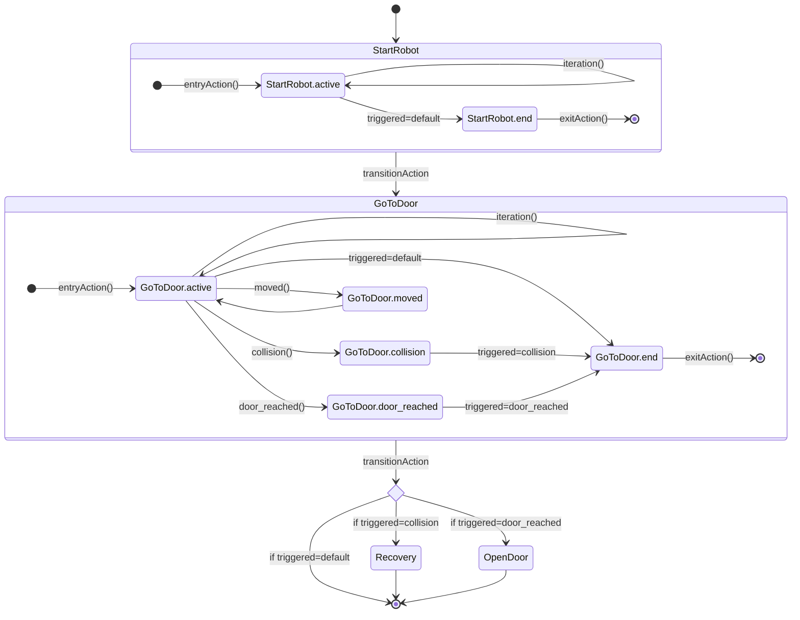

# LightFSM

This package implements a simple, lightweight finite-state-machine implementation in C++.
FSMs are perfectly suited to implement complex applications that can be in distinct states, e.g. robotic applications.

This package was extracted from [a robots project at the University of Tuebingen](https://github.com/betwo/sbc15_fsm) and is aimed to be re-usable in a more general context.

## Example Use Case

Take as an example a robot, that can open doors. The Robot can be in multiple states:
 `StartRobot`, `GoToDoor`, `OpenDoor` and `Recovery`.

The robot starts in the `StartRobot` state, and then switches to the `GoToDoor` state as soon as it wants to open the door.
It will stay in that state until either

1. The door has been reached, in which case we switch to `OpenDoor`.
2. A collision has happend, in which case we switch to `Recovery`.
3. Another reason to stop occurred, in which case we stop the application.

### FSM Diagram

As an FSM diagram, this could look like the following:



### Explanation

In the diagram above, the `GoToDoor` state is shown in more detail:

1. We start on the entry side
2. The `entryAction()` function of `GoToDoor` is called
3. We are then in the `active` substate and repeatedly call `iteration()` until the state should be changed.
4. There are multiple events that can happen:
   1. `collsion` is triggered when the robot collides with the environment
   2. `moved` is triggered when the robot has changed its position
   3. `door_reached` is triggered when the door can be opened
   4. A `default` event is triggered, if another reason occurred to change the state, e.g. the application should be shutdown.
5. Some these events are connected to a follow-up state. I.e. if the `collision` event is triggered, we remember this fact and transition out of the `GoToDoor` state into the `Recovery` state.
Similarly, we transition to `OpenDoor` if the `door_reached` event was triggered and into the exit of the FSM if the `default` event was triggered.
6. The `moved` event is not connected to any follow-up state, of if that one is triggered, no transition is taken.

In all cases where a event transition occurs, we have the following hooks available:

1. call is `GoToDoor::exitAction()`
2. `transitionAction` associated with the event that has been triggered
3. `entryAction` of the connected event.

### C++ Implementation

The following pseudo-code describes how we could implement the `GoToDoor` state:

```C++

class GoToDoor : public State
{
public:
    TriggeredEvent event_collision;
    TriggeredEvent event_door_reached;
    TriggeredEvent event_moved;

    void entryAction()
    {
        // called when state becomes active
    }

    void iteration()
    {
        // called while state is active

        if (haveMovedMoreThan1Meter()) {
            event_moved.trigger();
        }
        if (doorHasBeenReached()) {
            event_door_reached.trigger();
        }
        if (robotHasCollidedWithSomething()) {
            event_collision.trigger();
        }
    }

    void exitAction()
    {
        // called when state becomes inactive
    }

    double desiredFrequency() const
    {
        // the iteration callback shall be called 20 times per second
        return 20.0;
    }

};

int main() {
    // Our robot's states
    StartRobot start_robot;
    GoToDoor goto_door;
    Recovery recovery;
    OpenDoor open_door;

    // connect events to follow-up states to establish transitions
    start_robot.event_default >> goto_door;
    goto_door.event_collision >> recovery;
    goto_door.event_door_reached >> open_door;

    // state actions that are executed on the GoToDoor transitions
    goto_door.action_entry << []() { std::cout << "Entry: action entry." << '\n'; };
    goto_door.action_exit << []() { std::cout << "Entry: action exit." << '\n'; };

    // event actions that are executed when the events occur
    goto_door.event_collision << []() { std::cout << "Ouch." << '\n'; };
    goto_door.event_door_reached << []() { std::cout << "Door reached." << '\n'; };
    goto_door.event_moved << []() { std::cout << "I have moved." << '\n'; };

    // build the FSM
    StateMachine state_machine(&start_robot);

    // run the FSM
    StateMachineBasicExecutor executor(state_machine);
    executor.run([](State* state) {});

    return 0;
}
```
